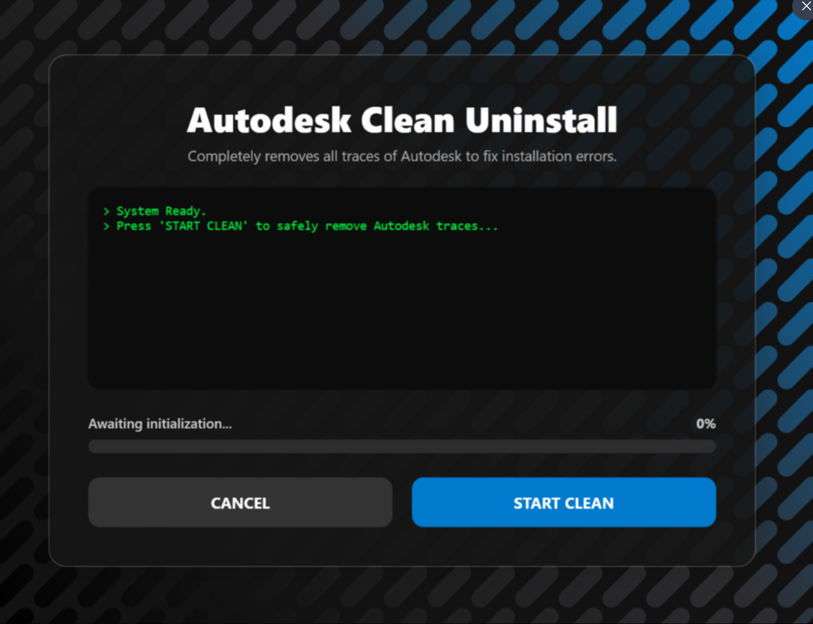

# 🚀 Autodesk Windows Fixer & Cleaner 🚀

**The ultimate, visually stunning PowerShell tool to completely remove all traces of Autodesk software from your Windows PC.**

---

## 🎯 What is this?
Are you having trouble reinstalling Autodesk products? Constantly hitting obscure error codes, licensing loops, or installation warnings? 

This tool is a **Full WPF GUI wrapped in PowerShell** that automatically elevates to Administrator to thoroughly purge your system of leftover Autodesk files, registry keys, and broken services. It provides a beautiful, responsive dark-mode experience while doing complex heavy lifting under the hood!

## ✨ Features
- 🛡️ **Auto-Elevation:** Automatically asks for Administrator privileges if not already explicitly elevated.
- 🎨 **Modern Dark UI:** Sleek, glassmorphism dark-mode UI with fluid progress tracking and animations.
- 🧹 **Deep Clean:** Aggressively purges leftover installation directories across `Program Files`, `ProgramData`, and `AppData`.
- 🛑 **Process Terminator:** Identifies and force-closes stubborn Autodesk background processes and licensing services.
- 🔑 **Registry Scrubber:** Deletes leftover Autodesk registry keys and unblocks frozen Windows uninstaller paths.
- 💻 **Live Real-time Log:** Watch precisely what the script is cleaning in real-time inside the integrated hacker-style terminal.

---

## 🛠️ How to Use

### Option 1: Using the Batch Launcher (Recommended)
1. Download the repository files to your computer.
2. Double-click on `Clean-Autodesk-Launcher.bat`.
3. Accept the Administrator prompt (UAC).
4. Click **START CLEAN** in the futuristic UI window!

### Option 2: Running the PowerShell Script Directly
1. Right-click on `Clean-Autodesk.ps1`.
2. Select **Run with PowerShell**.
3. *If prompted*, type `Y` to allow the execution policy temporarily.
4. Accept the Administrator prompt, and you're good to go!

---

## ⚠️ Warning
**This tool is destructive to existing Autodesk installations!** 

It is designed to completely remove **all traces** of Autodesk software from your system. Do not run this script if you have working Autodesk products installed that you wish to keep. Use this **only** when you intend to do a 100% clean wipe to start completely fresh or fix unresolvable installation errors.

---

## 📸 Screenshots
*(Pro-tip: Don't forget to take a screenshot of your beautiful new dark mode UI and drag & drop it here before sharing!)*

---

## 🛡️ Open Source & Safety (No Viruses!)
We understand that downloading executables (`.exe`) that ask for Administrator privileges can be concerning. Because this tool handles deep registry modifications and forceful process termination, **some overzealous antivirus programs might accidentally flag it as a false positive.**

That is exactly why **this entire project is 100% transparent and open-source!** 
You are highly encouraged to read through the [`Clean-Autodesk.ps1`](Clean-Autodesk.ps1) source code yourself to verify precisely what background commands are being executed. There is nothing hidden!

If you prefer not to download the pre-packaged release, you can simply clone this repository and run the raw PowerShell script manually.

---

## 🤝 Contributing
Found an obscure Autodesk folder or registry path we missed? Feel free to open issues or submit pull requests! If you edit the `Clean-Autodesk.ps1` file, make sure not to break the integrated XAML interface!

<b>Clean up your PC in style. 🚀</b>

